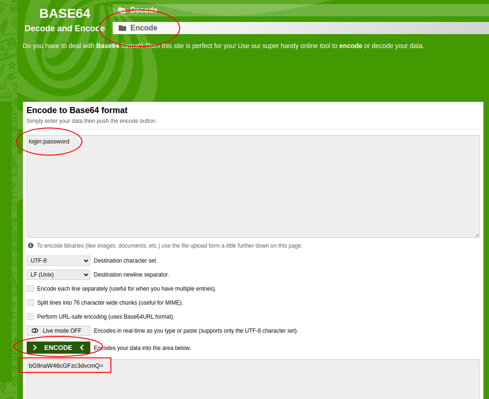
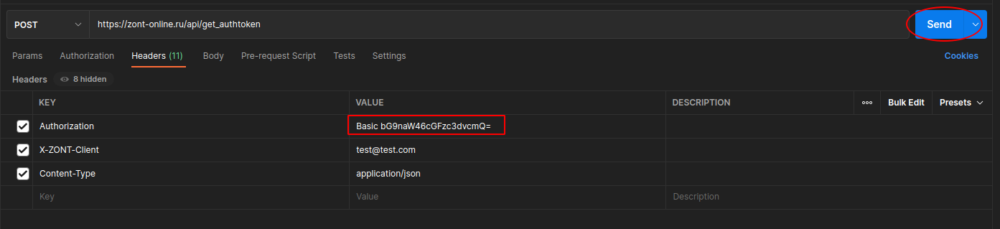
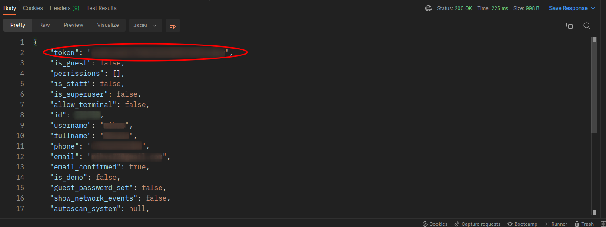
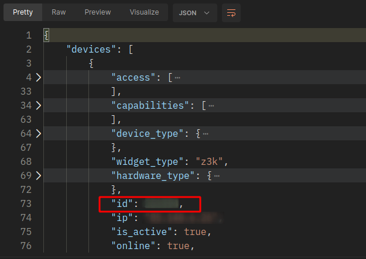
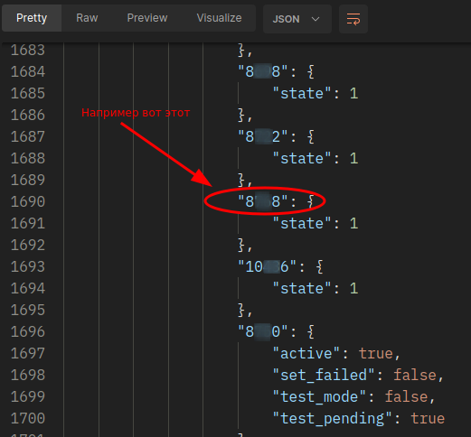

## Lighting ZONT
Скрипт **Lighting ZONT** позволяет управлять выходом контроллера
ZONT по восходу и закату солнца. К выходу контроллера
подключено внешнее реле. К реле подключена нагрузка, которой скрипт будет управлять.
Если lighting_schedule.json не заполнен, то данные о восходе 
и закате солнца подтягиваются с ресурса [sunrise-sunset.org](https://sunrise-sunset.org)
Есть возможность вручную редактировать включение и отключение освещения.
Документация для получения токена контроллера ZONT [тут](https://zont-online.ru/api/docs/).

Скрипт работает только для токена пользователя с одним устройством.
Токен получается для имени и логина назначенных производителем контроллера(на карточке в комплекте).
При необходимости расширения функционала пишите в issues. 

###### *Протестировано на контроллерах:*
* ZONT H2000+
*

## Установка
Для запуска приложения проделайте следующие шаги:
1. Склонируйте репозиторий.
2. Перейдите в каталог со скриптом и создайте виртуальное окружение:
```bash
cd lighting_zont/
python -m venv venv
```
3. Активируйте виртуальное окружение:
```bash
source venv\scripts\activate
```
4. Установите зависимости:
```bash
python -m pip install -r requirements.txt
```
5. Создайте в каталоге приложения файл .env:
```bash
touch .env
```
6. Заполните файл .env по примеру example_env.
7. Запустите скрипт:
```bash
python main.py
```

## Получение токена ZONT API
С помощью API клиента (например [postman](https://www.postman.com/downloads/))
отправьте POST запрос на endpoint https://zont-online.ru/api/get_authtoken
Этот метод должен отправляться с аутентификацией по паролю.
+ Закодируйте свой логин пароль в Base64 формат.
    * воспользуйтесь любыми кодировщиком, например [этим](https://www.base64encode.org/).
    * формат кодирования login:password
 
 
<details>
<summary>Пример декодирования тут</summary>



</details>

+ Добавьте в Headers post запроса поля со своими значениями:
    * Authorization
    * X-ZONT-Client
    * Content-Type

<details>
<summary>Пример Headers</summary>



</details>

<details>
<summary>Пример ответа</summary>



</details>

+ Полученный токен внесите в файл .env в поле XZONTTOKEN

## Получение id device и id object
Отправьте post запрос на адресс https://zont-online.ru/api/devices
c ключами Headers (значения подставьте свои):
* X-ZONT-Token
* X-ZONT-Client
* Content-Type

Тело запроса:
```json
{
    "load_io": true
}
```
Далее ищем в ответе id контроллера (device id) 
и id кнопки управления освещением (object id)

<details>
<summary>device id</summary>



</details>
<details>
<summary>object id</summary>



</details>

## Заполнение файла .env
+ **XZONTTOKEN** - токен авторизации ZONT API
+ **XZONTCLIENT** - ваш адрес электронной почты
+ **DEVICEID** - id вашего контроллера
+ **OBJECTID** - id элемента кнопка
+ **TIMEZONE** - ваша временная зона
+ **TIMEOFFSETON** - корректировка времени включения освещения полученного из сети
+ **TIMEOFFSETOFF** - корректировка времени выключения освещения полученного из сети
+ **LATITUDE** - широта вашего населённого пункта
+ **LONGITUDE** - долгота вашего населённого пункта

## Разработчик
**[Михаил Шутов](https://github.com/mihvs)**

*[связаться](https://t.me/MihVS)*